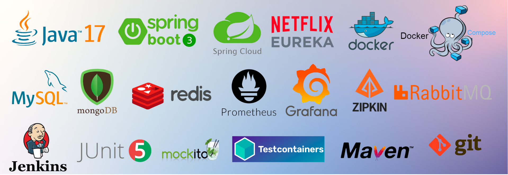

<div align="center">

# Url Shortener


Url shortener application with microservice architecture pattern
  
[How to run all things](#how-to-run-all-things) •
[How to use](#how-to-use) •
[Projects](#projects) •
[Roadmap](#roadmap) •
[Error response](#error-response)


    


</div>

## How to run all things

### Before you start
* Install docker and docker compose

### Run 
```$xslt
docker-compose up --build
```
## How to use

#### Create short url from long url
```
POST http://localhost:8080/api/v1/shortUrl
Content-Type: application/json
{
  "longUrl" : "https://www.google.com"
}

HTTP/1.1 201 
Content-Type: application/json
{
  "shortUrl": "Ny1"
}
```
#### Redirect to long url 
```
GET http://localhost:8080/api/v1/shortUrl/Ny1

HTTP/1.1 200
Redirections:
-> https://www.google.com/
```

## Projects

### Important Endpoints
* [http://localhost:8080](http://localhost:8080) - Api gateway
* [http://localhost:8761](http://localhost:8761) - Eureka dashboard
* [http://localhost:8888](http://localhost:8888) - Config server
* [http://localhost:15672](http://localhost:15672) - RabbitMq management (username/password: guest/guest)
* [http://localhost:9090](http://localhost:9090) - Prometheus 
* [http://localhost:3000](http://localhost:3000) - Grafana (username/password: admin/password)
* [http://localhost:9100](http://localhost:9100) - Node exporter
* [http://localhost:9411](http://localhost:9411) - Zipkin
* [http://localhost:5100](http://localhost:5100) - Url shortener service 
* [http://localhost:27017](http://localhost:27017) - MongoDB (username/password: rootuser/rootpass)
* [http://localhost:8081](http://localhost:8081) - Mongo express (username/password: rootuser/rootpass)
* [http://localhost:6379](http://localhost:6379) - Redis
* [http://localhost:5200](http://localhost:5200) - Range service 
* [http://localhost:3306](http://localhost:3306) - Mysql (username/password/database: range_app/p_range_app/url_shortener)
* [http://localhost:8082](http://localhost:8082) - Jenkins


### Services
* Implemented Docker and Docker compose for deployment.
* Implemented unit testing and integration testing using JUnit, Mockito and Testcontainers.
* Implemented swagger documentation

### Url shortener service
* Improved the performance by implementing Redis caching in the application, resulting in faster response times.
* Utilized MongoDB as the database for the Url Shortener service, resulting in improved performance and scalability, as well as easier implementation of features such as sharding and replica sets.
* If one range service goes down, other instances will be tried by OpenFeign.
* Implemented url validation
* [Swagger UI](http://localhost:5200/swagger-ui/index.html/)

### Range service
* Utilized Pessimistic locking in JPA for the Range service to share range without concurrency problem for multiple instances of Url shortener service.
* [Swagger UI](http://localhost:5200/swagger-ui/index.html/) 

### Config server
* Implemented Spring Cloud Config Server to store and manage configuration properties for multiple microservices.
* Spring Cloud Bus with RabbitMQ enables automatic reload of configuration changes across all instances of a microservice architecture, reducing downtime and increasing availability.
1. Push commits in config repository
2. Send request: POST http://localhost:8888/actuator/busrefresh

### Observability 
* Utilized Prometheus, Grafana, and Node exporter to monitor system performance and resource usage in real-time, allowing for proactive identification and resolution of potential issues.
* Implemented Zipkin for distributed tracing of microservices, helping to identify and diagnose performance issues within complex systems.
* Grafana setup:
1. Add Prometheus data source with url http://host.docker.internal:9090
2. Upload JSON file from observability/prometheus/grafana-dashboard.json

### Api Gateway 
* Utilized the Spring Cloud API Gateway to effectively manage and route traffic across multiple microservices, resulting in improved performance and scalability of the overall system.

### Discovery server
* Improved scalability and availability of services by using Eureka server for dynamic service discovery and load balancing.

## Roadmap
- [ ] Jenkins pipeline
- [ ] Kubernetes
- [ ] ELK stack
- [ ] Mysql master slave replication
- [ ] Authentication and authorization
- [ ] Rate limiting with Spring Cloud Gateway
- [ ] AWS

## Error response

```
POST /api/v1/shortUrl
Content-Type: application/json
{
  "longUrl" : ""
}

HTTP/1.1 400 
Content-Type: application/problem+json
{
  "type": "about:blank",
  "title": "ARGUMENT_VALIDATION_ERROR",
  "status": 400,
  "detail": "Url can not be empty",
  "instance": "/api/v1/shortUrl"
}
```

```
POST /api/v1/shortUrl
Content-Type: application/json
{
  "longUrl" : "ww.google"
}

HTTP/1.1 400 
Content-Type: application/problem+json
{
  "type": "about:blank",
  "title": "ARGUMENT_VALIDATION_ERROR",
  "status": 400,
  "detail": "Invalid URL format found",
  "instance": "/api/v1/shortUrl"
}
```

```
GET /api/v1/shortUrl/abcdef123456random

HTTP/1.1 404 
Content-Type: application/json
{
  "type": "about:blank",
  "title": "NOT_FOUND",
  "status": 404,
  "detail": "Long url is not found",
  "instance": "/api/v1/shortUrl/abcdef123456random"
}
```

```
Generic error response

HTTP/1.1 500 
Content-Type: application/json
{
  "type": "about:blank",
  "title": "SYSTEM_ERROR",
  "status": 500,
  "detail": "The server encountered an error and could not complete your request. Please try again later.",
  "instance": "/api/v1/shortUrl"
}
```
