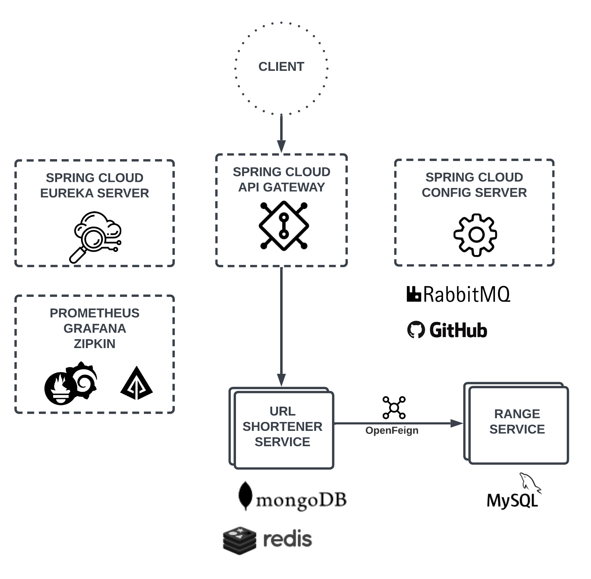

[](https://opensource.org/licenses/MIT) 

# Url Shortener

Url shortener application with microservice architecture pattern

- Highly maintainable and testable
- Independently deployable
- Capable of being developed by a small team

## How to run all things

### Before you start
* Install docker and docker compose

### Run
```$xslt
docker-compose -f docker-compose.yml -f docker-compose.dev.yml up
```

## Modules

Spring Cloud facilitates the development of applications by providing solutions such as load balancing, service registry, monitoring, and configuration.



## Services


### Important Endpoints
* [http://localhost:80](http://localhost:80) - Gateway
* [http://localhost:8761](http://localhost:8761) - Eureka Dashboard
* [http://localhost:9000/hystrix](http://localhost:9000/hystrix) - Hystrix Dashboard (paste Turbine stream link on the form)
* [http://localhost:8989](http://localhost:8989) - Turbine stream (source for the Hystrix Dashboard)
* [http://localhost:15672](http://localhost:15672) - RabbitMq management (default login/password: guest/guest)


### Url shortener service


| Method | Path              | Description                                
|--------|-------------------|-------------------------------------------
| POST   | api/v1/shortUrl/              | Create long url from short url 
| GET   | api/v1/shortUrl/{shortenedUrl} | Redirect to website using short url 


### Range service

| Method | Path           | Description 
|--------|----------------|-------------
| GET    | /api/v1/range  | Get range


### Config server
Config server allows to externally store variables. Application properties of url shortener and range services can be updated using config server without restarting them.

## Observability 

Prometheus
Grafana
Zipkin


* Collision is handled by fetching ranges from range service.
* Pessimistic locking implemented for avoiding collision in concurrent requests.
* If one range service goes down, one of the other instances will be tried by OpenFeign.
* High availability and load balancing achieved by replicated instances.
* MongoDB can scale horizontally and share the load.
* Reduced response time by caching shortened url.


* başarılı hatalı response örnekleri


